Protein Purification Workflow
============

Introduction
============
Basic Concept
-------------
This protein purification workflow is based on the affinity of proteins
tagged with six consecutive histidine residues (His-tag) with
nickel-nitrilotriacetic acid (Ni-NTA) metal-affinity chromatography
matrices.

Operations and Features
-----------------------
Operations of this workflow in Aquarium are divided into three
categories, including protein induction, His-tagged protein
purification, and protein verification. Each category is comprised of
several operations, all built in Aquarium.

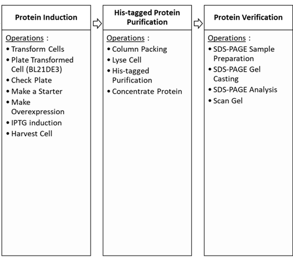

### Clone Protein Sequences into pET Vectors

To be compatible with this workflow, protein sequences have to be cloned
into pET vectors which contain a His-tag. Once bacterial clones are
established, the experiment proceeds to the next steps in series, which
are induction, purification, and verification of His-tagged proteins.
Those operations will be introduced later.

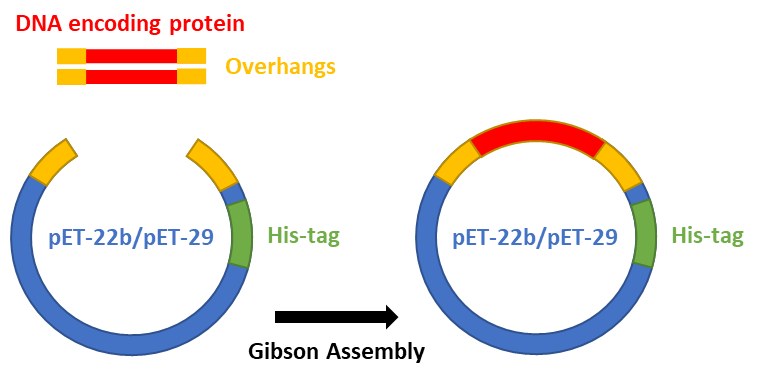

### Protein Induction in BL21DE3 Competent Cells

This category includes operations as follows: *Make a Starter*, *Make
Overexpression*, *IPTG Induction*, and *Harvest Cell*. The purpose is to
induce the expression of recombinant proteins encoded by pET vectors
which could be rapidly induced by the addition of
isopropyl-β-D-thiogalactoside (IPTG).

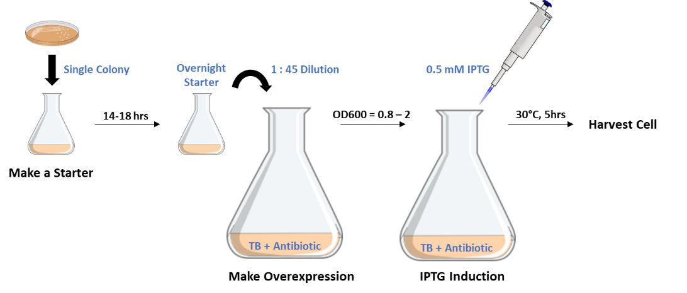

### His-tagged Protein Purification

This category includes *Column Packing*, *Lyse Cell, His-tagged
Purification,* and *Concentrate Protein*.

Detailed steps are as follows: (a) a column is packed with Ni-NTA 
agarose beads. (b) pre-equilibrium agarose beads with purification
buffer. (c) bacteria cell walls are lysed by sonication in the operation
of *Lyse Cell* to release proteins from cells into cell lysates. The
cell lysate is then separated to supernatant and pellet by high-speed
centrifuge. This supernatant, which target proteins are soluble in, is
then applied to a column packed with Ni-NTA agarose beads. (d) wash out
non-specific proteins with the wash buffer. (e) His-tagged proteins are
eluted from agarose beads with elution buffer. In this step, the high
imidazole concentration of 250 mM generates intense competitions between
imidazole and His-tag for binding to the Ni-NTA column which is utilized
for the elution of the desired protein.

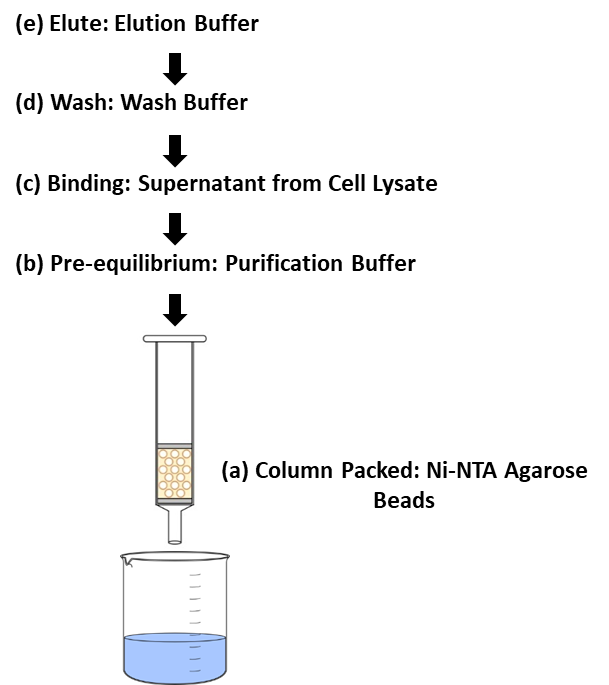

### Protein Identification

Protein separation by SDS-PAGE can be used to estimate relative
molecular weight, to determine the relative abundance of major proteins
in samples, and to determine the distribution of proteins among
fractions. This category contains Aquarium operations of *SDS-PAGE
Sample Preparation*, *SDS-Gel Casting*, *SDS-PAGE Analysis*, and *Scan
Gel*.

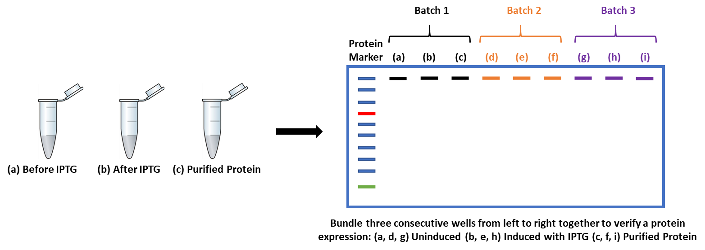

Overview
========
Schematic Diagram of the Workflow
---------------------------------

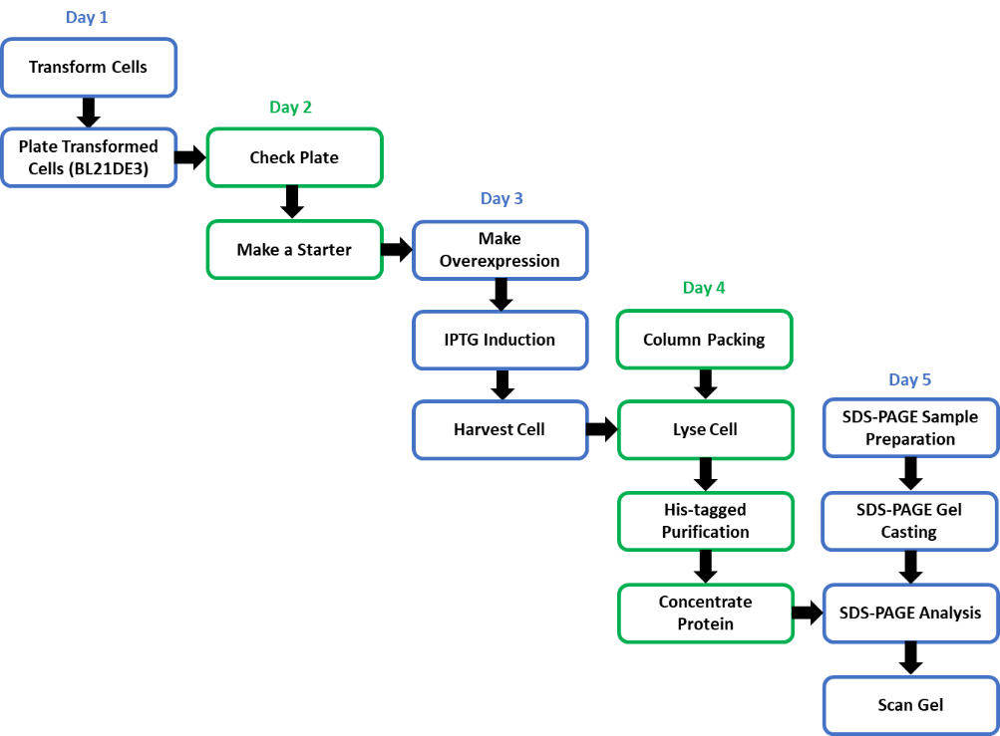

Timeline and Experiment Duration
--------------------------------

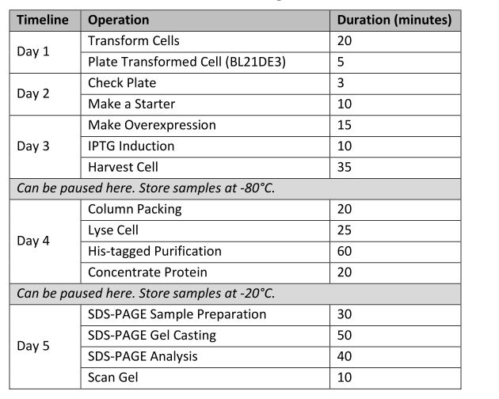

Designing a Plan
----------------

The following are general guidelines for using this workflow.

### Start a new plan:

A new protein sample must be created before starting a new plan. To
create a new sample, click SAMPLES in the Aquarium main menu, and then
click the NEW button to select "Protein" in the sample type. Users will
be asked to enter the protein size (in molecular weight, kDa) which will
be used for protein identification in SDS-PAGE analysis. Next, select a
desired imidazole concentration (mM) in the wash buffer that will be
used for washing out non-specific binding.

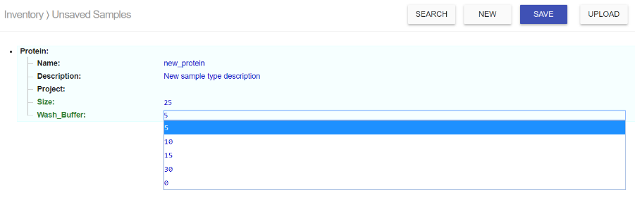

### Build a Purification Plan:

Directly start from the operation of *Transform Cells* with plasmid DNAs
which uses pET vectors as expression, and then proceed to the
purification workflow. An example of Aquarium planner illustrates how to
build a His-tagged protein purification workflow.

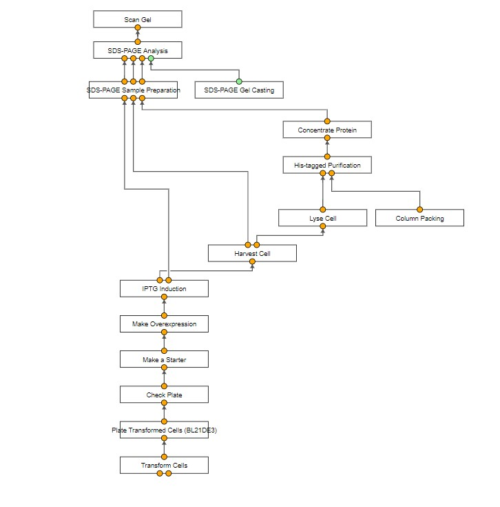

### Launch a plan:

There are three steps to ensure the plan is submitted correctly before
launching. Firstly, select the BL21DE3 competent cell (indicated with an
orange arrow) from Aquarium inventory and plasmid DNA of interest
(indicated with a blue arrow) as inputs for transformation,
respectively. Any plasmid DNA of interest that using pET vectors with
His-tag and T7 promotor would be compatible with this protein
purification workflow.

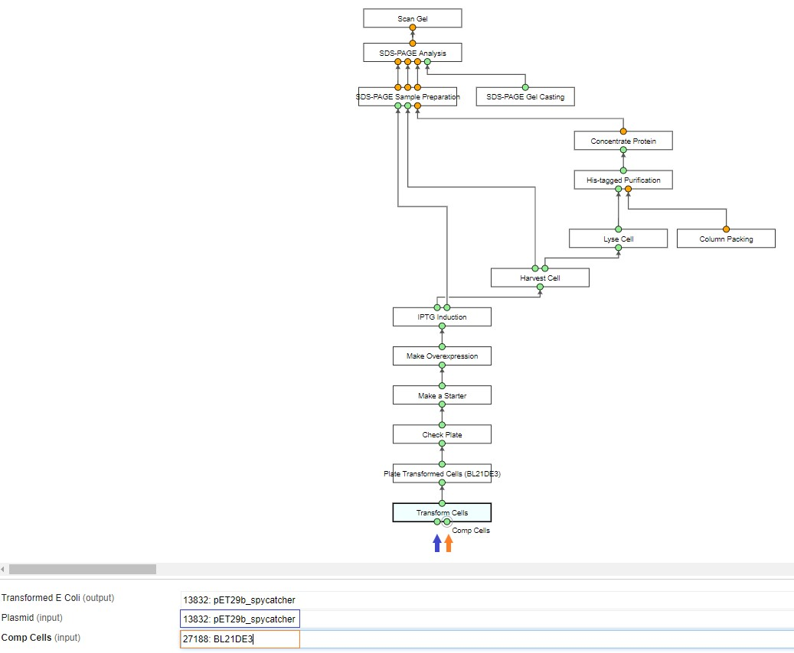

Secondly, select a protein sample as an output (indicated with a blue
arrow).

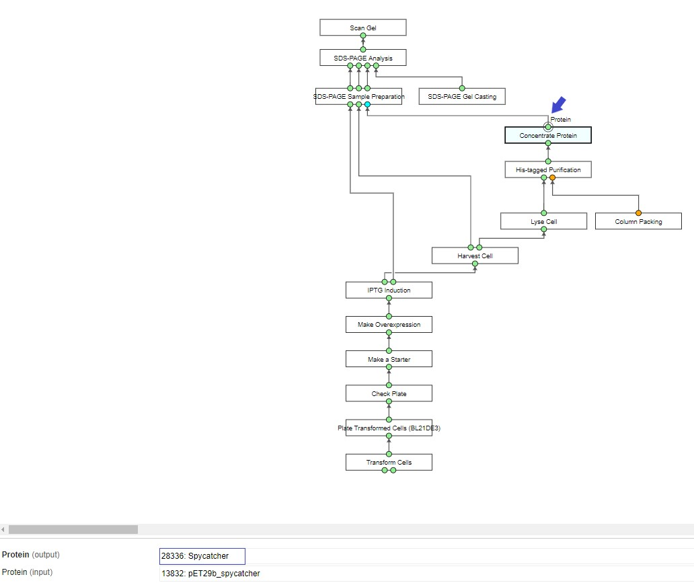

Finally, select Qiagen Ni-NTA for column packing (indicated with a blue
arrow).

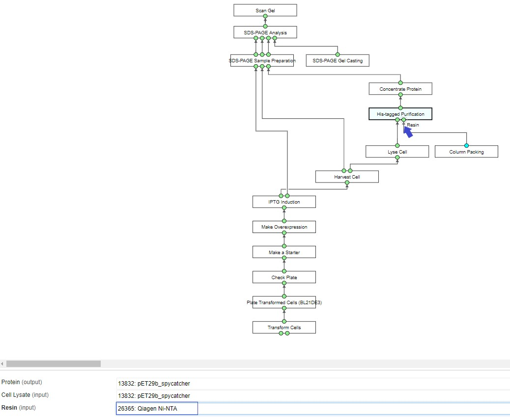

Then, save and launch the plan!!

Results of Test Run
===================
To test this workflow, we used three plasmid DNAs (SpyTag-Snoopcatcher, SnoopTag Spycatcher, and Spycatcher) for a test run. These DNA fragments have been cloned to the pET-29b vector. {#to-test-this-workflow-we-used-three-plasmid-dnas-spytag-snoopcatcher-snooptag-spycatcher-and-spycatcher-for-a-test-run.-these-dna-fragments-have-been-cloned-to-the-pet-29b-vector. .ListParagraph}

Samples
-------

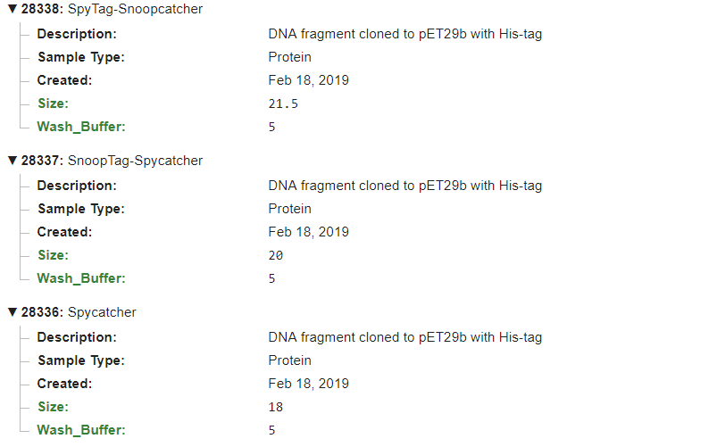

Concentration
-------------
A280 value is measured by Nanodrop to determine protein concentrations.

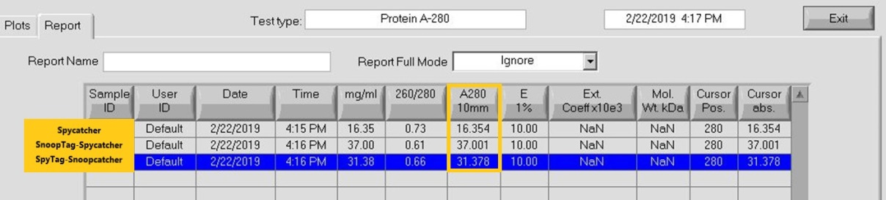

SDS-Gel Image
-------------

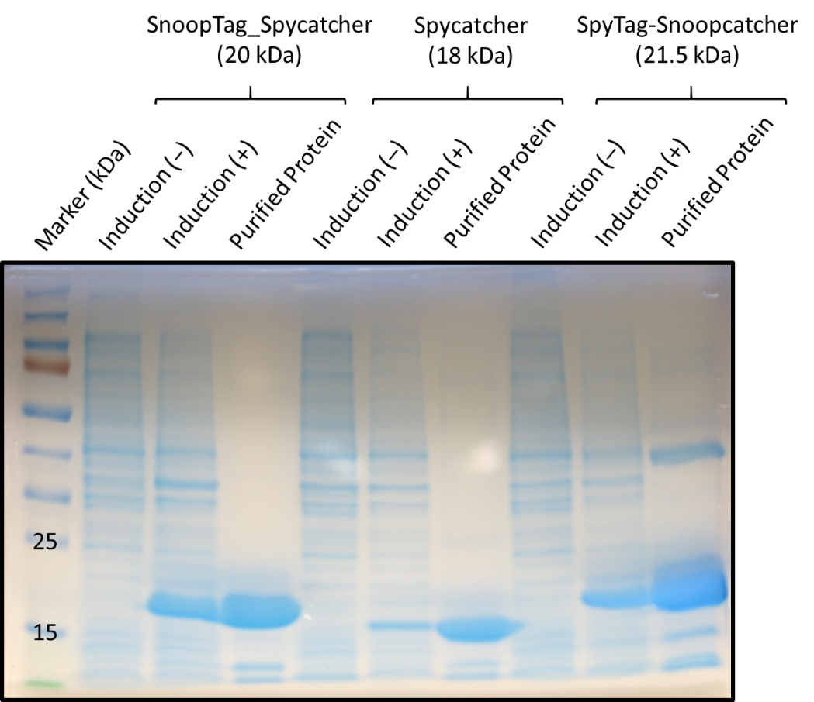

Operating Requirements
======================
List of Equipments
---------
High-Speed Centrifuge

Refrigerated Centrifuge

Small Benchtop Centrifuge

PCR Machine

Nano-Drop

Incubator Shaker

Digital Dry-Bath Heat Block

Lab Support Stand with Clamps

Sonicator

Laboratory Scales

Stir Plate

Electrophoresis Power Supplies

Mini-PROTEAN® Tetra Handcast System

Materials and Chemical Reagents
-------------------------------
Ni-NTA Agarose

BL21DE3 Competent Cell

LB Agar Plate with Antibiotics

TB medium

IPTG

Protease Inhibitor, EDTA-Free

Imidazole

PBS, pH7.4

Sodium Phosphate Dibasic, Na2HPO4

Sodium Phosphate Monobasic, NaH2PO4

Sodium chloride, NaCl

Trition X-100

2x Laemmli Sample Buffer

DI water, sterilized

Gibson Master Mix

Resolving Buffer

Stacking Buffer

30% Acrylamide/Bis Solution, 29:1

10% SDS Buffer

TEMED

Ammonium Persulfate (APS)

10x Tris / Glycine / SDS

Protein Ladder

Gel Staining Reagent

Laboratory Supplies
-------------------
Pipettor and Tip

Racks

Electroporation Cuvettes

Falcon Tubes 50mL / 225mL

Disposable Plastic Cuvettes

Disposable Gravity Flow Column with Adaptors

Concentrator

2L Erlenmeyer Flask

Serological Pipette

Disposable Droppers

Beakers

Gel Loading Tip
